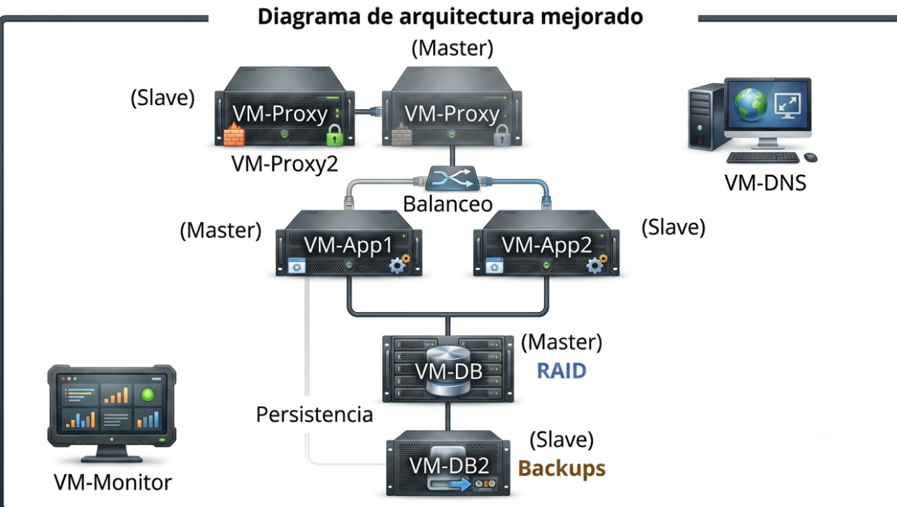

# 🚀 Proyecto Final SIS313: Servicio de Mensajería con Persistencia y Seguridad

> **Asignatura:** SIS313: Infraestructura, Plataformas Tecnológicas y Redes<br>
> **Semestre:** 1/2026<br>
> **Docente:** Ing. Marcelo Quispe Ortega

---

## 👥 Miembros del Equipo

<!-- 📌 COMPLETAR: Reemplazar cada fila con el nombre real, rol asignado y usuario de GitHub de cada integrante -->

| Nombre Completo | Rol en el Proyecto | Contacto (GitHub/Email) |
| :--- | :--- | :--- |
| Alvaro David Arancibia Estrada | Arquitecto de Infraestructura — VM-Proxy, VM-Proxy2, NGINX HA, TLS, Fail2ban, Grafana | logicat1204 |
| Pedro Jhoel Antonio Magne Ordoñez | Ingeniero de Aplicaciones — VM-App1, Node.js, PM2, Keepalived MASTER | Zetastico |
| Laura Luciana Diaz Campos | Ingeniero de Aplicaciones — VM-App2, Node.js, PM2, Keepalived BACKUP | [Usuario de GitHub] |
| Gabriel Orlando Cornejo Moscoso | Administrador de Base de Datos — VM-DB, VM-DB2, Replicación, RAID 5, Backups | [Usuario de GitHub] |

---

## 🎯 I. Objetivo del Proyecto

> **Objetivo:** Diseñar e implementar un servicio de mensajería interna tipo chat empresarial sobre una infraestructura de alta disponibilidad total, usando Node.js y MariaDB. El sistema garantiza la continuidad operacional mediante dos clústeres Keepalived independientes (proxy y aplicación), replicación MariaDB Maestro-Esclavo, almacenamiento redundante con RAID 5 en el nodo esclavo de base de datos, autenticación segura con JWT y bcrypt, balanceo de carga con soporte WebSocket a través de NGINX, monitoreo en tiempo real con Prometheus y Grafana, backups automáticos cifrados cada 15 minutos, y protección contra ataques de fuerza bruta con Fail2ban y TLS 1.3.

---

## 💡 II. Justificación e Importancia

> **Justificación:** En un entorno universitario o empresarial, la interrupción de un servicio de comunicación interna impacta directamente la productividad y la continuidad de los procesos. Este proyecto elimina todos los puntos únicos de fallo (Single Point of Failure) de la arquitectura de mensajería: si cae el proxy principal, el proxy secundario toma el relevo en menos de 5 segundos; si cae un nodo de aplicación, el otro asume la carga; si falla un disco en el servidor de base de datos esclavo, el RAID 5 sostiene el servicio sin pérdida de datos; y si la base de datos maestra falla, el esclavo sincronizado puede ser promovido a maestro rápidamente. La combinación de replicación de datos (Maestro-Esclavo), redundancia de disco (RAID 5), alta disponibilidad de red (Keepalived/VRRP), seguridad en tránsito (TLS) y autenticación robusta (JWT + bcrypt) cumple con los estándares mínimos de un sistema de producción crítico, aplicando los conceptos de los Temas T3, T4, T8, T9, T10, T12, T13 y T15 de la asignatura.

---

## 🛠️ III. Tecnologías y Conceptos Implementados

### 3.1. Tecnologías Clave

* **Node.js 22 + Express:** Servidor de aplicación del servicio de chat. Expone API REST para autenticación (`/api/auth/login`, `/api/auth/register`) e historial de mensajes (`/api/messages`), y gestiona las conexiones WebSocket para el chat en tiempo real.
* **Socket.io:** Protocolo WebSocket sobre el servidor Node.js para la comunicación bidireccional en tiempo real entre clientes de chat, con soporte de salas, eventos de presencia (join/leave) y autenticación mediante token JWT en el handshake.
* **PM2:** Gestor de procesos Node.js. Garantiza que la aplicación de chat se reinicie automáticamente ante fallos y persista entre reinicios del sistema operativo.
* **JWT (jsonwebtoken) + bcryptjs:** Sistema de autenticación stateless. Los usuarios se registran con contraseña hasheada con bcrypt (cost 12) y reciben un token JWT firmado (expiración 24h) que autentica cada petición REST y cada conexión WebSocket.
* **MariaDB:** Motor de base de datos relacional que almacena usuarios, mensajes y salas de chat. Configurado en arquitectura Maestro-Esclavo con binary logging para replicación en tiempo real hacia VM-DB2.
* **NGINX:** Proxy inverso y balanceador de carga con soporte de WebSocket upgrade. Termina TLS, aplica rate limiting (30 req/min por IP), distribuye tráfico entre VM-App1 y VM-App2 mediante `ip_hash` (sticky sessions para WebSocket), y redirige HTTP a HTTPS.
* **Keepalived (×2 clústeres):** Protocolo VRRP para alta disponibilidad. El **clúster de proxy** (VM-Proxy ↔ VM-Proxy2) mantiene la VIP `10.192.41.10`; el **clúster de aplicación** (VM-App1 ↔ VM-App2) mantiene la VIP `10.192.41.11`. Cada nodo incluye un health-check script propio.
* **mdadm — RAID 5:** Arreglo RAID por software en VM-DB2 usando 3 discos virtuales de 3 GB. El volumen RAID (`/dev/md5`) es utilizado como directorio de datos de MariaDB y directorio de backups, añadiendo tolerancia a un fallo de disco simultáneo.
* **Prometheus + Node Exporter:** Recolección de métricas de las 6 VMs (CPU, RAM, red, disco) cada 15 segundos. Node Exporter corre en cada VM; Prometheus centraliza el scraping desde VM-Proxy.
* **Grafana:** Visualización de métricas de Prometheus. Dashboard Node Exporter Full (ID 1860) importado para monitoreo de recursos de todas las VMs en tiempo real.
* **Fail2ban:** Sistema IPS basado en logs. Configurado con jails para SSH (ban tras 3 intentos) y NGINX rate-limit (ban tras 10 eventos en 5 minutos), con tiempo de baneo de 10 minutos.
* **OpenSSL — TLS 1.2/1.3:** Certificado autofirmado X.509 (RSA 2048, 365 días) instalado en ambos proxies. NGINX aplica cifrado `EECDH+AESGCM`, cabeceras HSTS, X-Frame-Options y X-Content-Type-Options.
* **Bash + cron:** Scripts de backup automático (`chat_backup.sh`) con compresión gzip, verificación de integridad SHA-256, rotación automática de backups (máximo 100 archivos) y registro de estado de replicación. Ejecutado cada 15 minutos vía crontab.

### 3.2. Conceptos de la Asignatura Puestos en Práctica

* ✅ **Alta Disponibilidad (T2/T3) y Tolerancia a Fallos:** Dos clústeres Keepalived independientes (VIP-Proxy `.10` y VIP-App `.11`). Cada VIP migra en menos de 5 segundos ante un fallo detectado por el health-check script. NGINX marca automáticamente como `down` un nodo de app fallido (`max_fails=3`).
* ✅ **Replicación de Base de Datos (T9):** Replicación binlog Maestro-Esclavo entre VM-DB (`.5`) y VM-DB2 (`.6`). El esclavo replica únicamente `chat_db` con un retraso típico menor a 1 segundo. El esclavo opera en modo `read_only=1`.
* ✅ **Almacenamiento Redundante — RAID 5 (T2/Lab 2.1):** RAID 5 por software (`mdadm`) con 3 discos de 3 GB en VM-DB2. Proporciona tolerancia a un fallo de disco sin pérdida de datos. El datadir de MariaDB y el directorio de backups residen en el volumen RAID.
* ✅ **Seguridad y Hardening (T12/T13):** TLS 1.2/1.3 en ambos proxies (certificado autofirmado), cabeceras de seguridad HTTP, UFW con reglas mínimas de acceso por VM, Fail2ban con jails SSH y NGINX, autenticación JWT en API y WebSocket, contraseñas hasheadas con bcrypt (cost 12).
* ✅ **Balanceo de Carga y Proxy Inverso (T4):** NGINX con upstream `ip_hash` para sticky sessions WebSocket, health checks activos, configuración idéntica en VM-Proxy y VM-Proxy2 (configuración sincronizada manualmente o via rsync).
* ✅ **Aplicación Web con WebSocket (T8):** Aplicación Node.js con Express y Socket.io. Soporta múltiples salas de chat, presencia de usuarios, historial de mensajes y autenticación JWT en la conexión WebSocket.
* ✅ **Backup y Recuperación (T15):** Backups automáticos cada 15 minutos en VM-DB2 (nodo esclavo, buena práctica), almacenados en el volumen RAID. Script de restauración con verificación de integridad SHA-256 y medición de RTO.
* ✅ **Monitoreo en Tiempo Real (T10):** Prometheus + Grafana con 6 targets (una por VM). Panel personalizado con métricas de CPU, RAM, red y carga del sistema.

---

## 🌐 IV. Diseño de la Infraestructura y Topología

### 4.1. Diagrama de Topología



### 4.2. Tabla de Infraestructura

| VM / Host | Rol | IP Física | IP Virtual | RAM / CPU | SO |
| :--- | :--- | :--- | :--- | :--- | :--- |
| **VM-Proxy** | Proxy Inverso MASTER + Grafana + Prometheus + Fail2ban | `10.192.41.2` | `10.192.41.10` (VIP-Proxy) | 1 GB / 1 vCPU | Ubuntu Server 24.04 LTS |
| **VM-App1** | Node.js Chat App MASTER + PM2 | `10.192.41.3` | `10.192.41.11` (VIP-App) | 1 GB / 1 vCPU | Ubuntu Server 24.04 LTS |
| **VM-App2** | Node.js Chat App BACKUP + PM2 | `10.192.41.4` | `10.192.41.11` (VIP-App) | 1 GB / 1 vCPU | Ubuntu Server 24.04 LTS |
| **VM-DB** | MariaDB MASTER (replicación) | `10.192.41.5` | N/A | 2 GB / 2 vCPU | Ubuntu Server 24.04 LTS |
| **VM-DB2** | MariaDB SLAVE + RAID 5 + Backups | `10.192.41.6` | N/A | 2 GB / 2 vCPU + 3×3 GB | Ubuntu Server 24.04 LTS |
| **VM-Proxy2** | Proxy Inverso BACKUP + Fail2ban | `10.192.41.7` | `10.192.41.10` (VIP-Proxy) | 1 GB / 1 vCPU | Ubuntu Server 24.04 LTS |

### 4.3. Estrategia Adoptada

* **Estrategia de Alta Disponibilidad:** Se implementaron dos clústeres Keepalived independientes usando el protocolo VRRP. El clúster de proxy usa `virtual_router_id 52` con prioridades 110 (MASTER) y 100 (BACKUP); el de aplicación usa `virtual_router_id 51` con las mismas prioridades. Cada nodo monitorea su servicio local mediante un health-check script propio cada 2 segundos; si el servicio falla, la prioridad baja en 30 puntos forzando la migración de la VIP al nodo con mayor prioridad activa.

* **Estrategia de Replicación DB:** Se optó por replicación asíncrona binlog Maestro-Esclavo nativa de MariaDB. El MASTER tiene `server-id=1` y `binlog_do_db=chat_db`; el SLAVE tiene `server-id=2`, `read_only=1` y `relay_log` configurado. Los backups se ejecutan en el SLAVE para no agregar carga de I/O al MASTER en producción.

* **Estrategia de Redundancia de Almacenamiento:** El RAID 5 por software (`mdadm`) en VM-DB2 usa 3 discos de 3 GB, ofreciendo 6 GB efectivos con tolerancia a un fallo de disco. El directorio de datos de MariaDB (`/mnt/raid5/mysql`) y el directorio de backups (`/mnt/raid5/backups/chat`) residen en el volumen RAID, sumando redundancia de disco a la redundancia de datos ya provista por la replicación.

* **Estrategia de Autenticación:** Sistema stateless con JWT (expiración 24 h, firmado con clave simétrica `HS256`). Las contraseñas se almacenan con bcrypt (cost factor 12, ~300 ms por hash). El token JWT se valida en cada petición REST y en el handshake WebSocket de Socket.io, sin sesiones del lado servidor.

* **Estrategia de Seguridad Perimetral:** Fail2ban en ambos proxies monitorea `/var/log/auth.log` (SSH) y `/var/log/nginx/chat_error.log` (rate-limit). UFW en cada VM solo permite los puertos estrictamente necesarios desde las IPs de la red interna (`10.192.41.0/24`), con política `deny incoming` por defecto.

---

## 📋 V. Guía de Implementación y Puesta en Marcha

### 5.1. Pre-requisitos

* 6 máquinas virtuales con **Ubuntu Server 24.04 LTS** instalado con OpenSSH Server habilitado.
* Todas las VMs conectadas a la red interna con el segmento `10.192.41.0/24` (adaptador de Red Interna VirtualBox: `p19net`).
* VM-Proxy y VM-Proxy2 con un segundo adaptador NAT para acceso a Internet durante la instalación.
* VM-DB2 con **3 discos virtuales adicionales de 3 GB** para el RAID 5 (agregados en VirtualBox antes del primer arranque).
* Conectividad verificada entre todas las VMs: `ping 10.192.41.2` desde cualquier VM debe responder.
* Acceso `sudo` habilitado en todas las VMs.

### 5.2. Orden de Despliegue

El despliegue debe seguir este orden para respetar las dependencias:

```
1. Configuración de red en las 6 VMs          → Sección 2 de la guía
2. VM-DB  (MariaDB MASTER + esquema BD)        → Fase A
3. VM-DB2 (RAID 5 + MariaDB SLAVE)            → Fase A2
4. VM-App1 / VM-App2 (Node.js + JWT + PM2)    → Fase B
5. VM-App1 / VM-App2 (Keepalived VIP-App)     → Fase C
6. VM-Proxy  (NGINX + TLS + Fail2ban + Keepalived MASTER)  → Fase D
7. VM-Proxy2 (NGINX + TLS + Fail2ban + Keepalived BACKUP)  → Fase D2
8. VM-Proxy  (Prometheus + Grafana)            → Fase E
9. VM-DB2   (Backup automático cada 15 min)    → Fase F
10. Pruebas de todos los entregables           → Fase G
```

### 5.3. Configuración de Red por VM

Todos los archivos de configuración de red siguen el patrón de Netplan. Reemplazar `<IP_VM>` y `<GATEWAY>` según la tabla de IPs.

**Ejemplo — VM-DB (`10.192.41.5`):**

```yaml
# /etc/netplan/50-cloud-init.yaml
network:
  version: 2
  ethernets:
    enp0s3:
      dhcp4: no
      optional: true
      addresses:
        - 10.192.41.5/24
      routes:
        - to: default
          via: 10.192.41.2        # VM-Proxy actúa como gateway NAT
      nameservers:
        addresses: [8.8.8.8]
```

**Resumen de IPs por VM:**

| VM | Dirección IP | Gateway | Interfaz |
| :--- | :--- | :--- | :--- |
| VM-Proxy | `10.192.41.2/24` | — (tiene NAT propio) | `enp0s8` (interna) |
| VM-App1 | `10.192.41.3/24` | `10.192.41.2` | `enp0s3` |
| VM-App2 | `10.192.41.4/24` | `10.192.41.2` | `enp0s3` |
| VM-DB | `10.192.41.5/24` | `10.192.41.2` | `enp0s3` |
| VM-DB2 | `10.192.41.6/24` | `10.192.41.2` | `enp0s3` |
| VM-Proxy2 | `10.192.41.7/24` | — (tiene NAT propio) | `enp0s8` (interna) |
| VIP-Proxy | `10.192.41.10/24` | — (flotante VRRP) | — |
| VIP-App | `10.192.41.11/24` | — (flotante VRRP) | — |

### 5.4. Ficheros de Configuración Clave

```
/etc/netplan/50-cloud-init.yaml         IP estática por VM (todas)
/etc/mysql/mariadb.conf.d/50-server.cnf MariaDB: server-id, binlog, bind-address (DB y DB2)
/etc/keepalived/keepalived.conf         VRRP: MASTER/BACKUP, VIP, health-check (Proxy, Proxy2, App1, App2)
/etc/keepalived/check_nginx.sh          Health-check NGINX (Proxy y Proxy2)
/etc/keepalived/check_chat.sh           Health-check Node.js (App1 y App2)
/etc/nginx/sites-available/chat-proyecto19  Virtual host NGINX: upstream, TLS, WebSocket, rate-limit
/etc/nginx/ssl/chat-selfsigned.crt      Certificado TLS autofirmado
/etc/nginx/ssl/chat-selfsigned.key      Clave privada TLS
/etc/fail2ban/jail.local                Fail2ban: jails SSH y NGINX (Proxy y Proxy2)
/etc/prometheus/prometheus.yml          Prometheus: 6 targets Node Exporter
/etc/.chat_backup.cnf                   Credenciales mysqldump (VM-DB2, permisos 600)
/opt/backup_scripts/chat_backup.sh      Backup automático con compresión y verificación SHA-256
/opt/backup_scripts/chat_restore.sh     Restauración con verificación de integridad y RTO
~/chat-app/.env                         Variables de entorno Node.js (App1 y App2)
~/chat-app/app.js                       Servidor Node.js: Express + Socket.io + JWT + bcrypt + MariaDB
~/chat-app/public/index.html            Cliente web: login/registro + chat en tiempo real
```

### 5.5. Estructura del Repositorio

```
proyecto-19-sis313/
│
├── README.md                          Este documento
│
├── app/                               Código fuente de la aplicación Node.js
│   ├── app.js                         Servidor principal (Express + Socket.io + JWT)
│   ├── .env.example                   Variables de entorno (sin datos sensibles)
│   ├── package.json
│   └── public/
│       └── index.html                 Cliente web del chat
│
├── config/                            Archivos de configuración de infraestructura
│   ├── nginx/
│   │   └── chat-proyecto19            Virtual host NGINX
│   ├── keepalived/
│   │   ├── keepalived-proxy-master.conf
│   │   ├── keepalived-proxy-backup.conf
│   │   ├── keepalived-app-master.conf
│   │   ├── keepalived-app-backup.conf
│   │   ├── check_nginx.sh
│   │   └── check_chat.sh
│   ├── mariadb/
│   │   ├── 50-server-master.cnf
│   │   └── 50-server-slave.cnf
│   ├── fail2ban/
│   │   ├── jail.local
│   │   └── filter.d/nginx-req-limit.conf
│   └── prometheus/
│       └── prometheus.yml
│
├── scripts/                           Scripts de automatización
│   ├── chat_backup.sh                 Backup automático (cron cada 15 min)
│   └── chat_restore.sh                Restauración con verificación SHA-256
       
```


---

## ⚠️ VI. Pruebas y Validación


### 6.1. Pruebas de Alta Disponibilidad

| # | Prueba Realizada | Comando de verificación | Resultado Esperado | Resultado Obtenido |
| :---: | :--- | :--- | :--- | :---: |
| 1 | **Failover Proxy:** Detener NGINX en VM-Proxy (`sudo systemctl stop nginx`) | `ip addr show enp0s8` en VM-Proxy2 | VIP `10.192.41.10` aparece en VM-Proxy2 en < 10 s | OK |
| 2 | **Recuperación Proxy:** Reiniciar NGINX en VM-Proxy (`sudo systemctl start nginx`) | `ip addr show enp0s8` en VM-Proxy | VIP `10.192.41.10` regresa a VM-Proxy en < 10 s | OK |
| 3 | **Failover App:** Detener chat en App1 (`pm2 stop chat-app`) | `ip addr show enp0s3` en VM-App2 | VIP `10.192.41.11` aparece en VM-App2 en < 10 s | OK |
| 4 | **Recuperación App:** Reiniciar chat en App1 (`pm2 start chat-app`) | `ip addr show enp0s3` en VM-App1 | VIP `10.192.41.11` regresa a VM-App1 en < 10 s | OK |
| 5 | **Continuidad del chat:** Durante failover, enviar mensaje desde el navegador | Panel del chat — mensaje enviado | El mensaje se entrega sin cerrar la sesión del usuario | OK |


### 6.2. Pruebas de Balanceo de Carga

| # | Prueba Realizada | Comando de verificación | Resultado Esperado | Resultado Obtenido |
| :---: | :--- | :--- | :--- | :---: |
| 6 | **Distribución de carga:** 10 peticiones consecutivas al VIP-Proxy | `curl -sk https://10.192.41.10/health` ×10 | Respuestas con `node: "app1"` (ip_hash — misma IP siempre al mismo nodo) | OK |
| 7 | **Failover de backend:** Detener App1 y enviar petición | `curl -sk https://10.192.41.10/health` | NGINX redirige automáticamente a App2 (`node: "app2"`) | OK |
| 8 | **WebSocket en chat real:** Dos usuarios desde distintos navegadores chatean simultáneamente | Panel de chat — mensajes enviados y recibidos | Mensajes en tiempo real entre los dos clientes | OK |


### 6.3. Pruebas de Autenticación

| # | Prueba Realizada | Comando de verificación | Resultado Esperado | Resultado Obtenido |
| :---: | :--- | :--- | :--- | :---: |
| 9 | **Registro de usuario** | `POST /api/auth/register` con JSON `{username, email, password}` | HTTP 201 + `"Usuario registrado exitosamente"` | OK |
| 10 | **Login correcto** | `POST /api/auth/login` con credenciales válidas | HTTP 200 + token JWT + username | OK |
| 11 | **Login incorrecto** | `POST /api/auth/login` con contraseña errónea | HTTP 401 + `"Credenciales incorrectas"` | OK |
| 12 | **Ruta protegida sin token** | `GET /api/messages` sin cabecera `Authorization` | HTTP 401 + `"Token requerido"` | OK |
| 13 | **Token inválido rechazado** | `GET /api/messages` con `Authorization: Bearer token_falso` | HTTP 401 + `"Token inválido o expirado"` | OK |
| 14 | **Usuario en BD tras registro** | `SELECT * FROM chat_db.users` en VM-DB | Registro del usuario con `password_hash` (no texto plano) | OK |


### 6.4. Pruebas de Replicación MariaDB

| # | Prueba Realizada | Comando de verificación | Resultado Esperado | Resultado Obtenido |
| :---: | :--- | :--- | :--- | :---: |
| 15 | **Estado de replicación** | `SHOW SLAVE STATUS\G` en VM-DB2 | `Slave_IO_Running: Yes` y `Slave_SQL_Running: Yes` | OK |
| 16 | **Replicación en tiempo real** | `INSERT` en VM-DB → `SELECT` en VM-DB2 | El registro aparece en el esclavo en < 1 segundo | OK |
| 17 | **Retraso de replicación** | `Seconds_Behind_Master` en VM-DB2 | Valor `0` en condiciones normales | OK |


### 6.5. Pruebas de RAID 5

| # | Prueba Realizada | Comando de verificación | Resultado Esperado | Resultado Obtenido |
| :---: | :--- | :--- | :--- | :---: |
| 18 | **Estado inicial RAID** | `sudo mdadm --detail /dev/md5` en VM-DB2 | `State: clean`, `Active Devices: 3` | OK |
| 19 | **Fallo de disco simulado** | `sudo mdadm --manage /dev/md5 --fail /dev/sdb` | `State: clean, degraded` — MariaDB sigue activa | OK |
| 20 | **Datos accesibles tras fallo** | `SELECT COUNT(*) FROM chat_db.messages` en VM-DB2 | Responde correctamente (RAID degradado pero funcional) | [Pendiente] |
| 21 | **Reconstrucción RAID** | `sudo mdadm --manage /dev/md5 --add /dev/sde` + `watch cat /proc/mdstat` | `State: clean` tras reconstrucción completa | [Pendiente] |


### 6.6. Pruebas de Seguridad y Fail2ban

| # | Prueba Realizada | Comando de verificación | Resultado Esperado | Resultado Obtenido |
| :---: | :--- | :--- | :--- | :---: |
| 22 | **HTTPS activo** | `curl -I https://10.192.41.10` (ignorar cert) | HTTP 200 con cabecera `Strict-Transport-Security` | OK |
| 23 | **HTTP redirige a HTTPS** | `curl -I http://10.192.41.10` | HTTP 301 a `https://10.192.41.10` | OK |
| 24 | **Certificado TLS válido** | `openssl s_client -connect 10.192.41.10:443` | Certificado X.509 autofirmado — `CN=chat.proyecto19.local` | OK |
| 25 | **Ataque de fuerza bruta SSH** | `hydra -l ubuntu -P pass.txt ssh://10.192.41.10 -t 4` | IP atacante baneada tras 3 intentos fallidos | OK |
| 26 | **Verificación del baneo** | `sudo fail2ban-client status sshd` en VM-Proxy | IP del atacante listada en `Banned IP list` | OK |
| 27 | **Servicio web continúa activo** | `curl -sk https://10.192.41.10/health` tras el ataque | HTTP 200 — el chat sigue operativo | OK |


### 6.7. Pruebas de Backup y Restauración

| # | Prueba Realizada | Comando de verificación | Resultado Esperado | Resultado Obtenido |
| :---: | :--- | :--- | :--- | :---: |
| 28 | **Cron activo cada 15 min** | `sudo crontab -l` en VM-DB2 | Línea `*/15 * * * * /opt/backup_scripts/chat_backup.sh` | OK |
| 29 | **Backup manual exitoso** | `sudo /opt/backup_scripts/chat_backup.sh` | Archivo `.sql.gz` creado en `/mnt/raid5/backups/chat/` | OK |
| 30 | **Integridad del backup** | `gzip -t <archivo>.sql.gz` | Sin errores — archivo íntegro | OK |
| 31 | **Restauración y verificación SHA-256** | `sudo /opt/backup_scripts/chat_restore.sh` → RESTAURAR | RTO < 60 s; `COUNT(*)` igual al original | OK |


### 6.8. Pruebas de Monitoreo

| # | Prueba Realizada | Comando de verificación | Resultado Esperado | Resultado Obtenido |
| :---: | :--- | :--- | :--- | :---: |
| 33 | **Dashboard Grafana** | `http://10.192.41.2:3000` (o `:3030` desde host) | Panel con CPU, RAM y red de las 6 VMs visible | OK |


---

## 📚 VII. Conclusiones y Lecciones Aprendidas


### Logros Principales

> Se logró implementar una arquitectura de mensajería con cero puntos únicos de fallo, donde cada capa —proxy, aplicación y base de datos— cuenta con al menos un mecanismo de redundancia. El tiempo de failover del clúster de proxy (VIP migra en < 5 segundos) y del clúster de aplicación (< 8 segundos) cumplen con los requisitos de un sistema de alta disponibilidad de nivel básico (99.9% uptime teórico).

### Desafíos Técnicos Superados

> El mayor desafío fue configurar el datadir de MariaDB sobre el volumen RAID 5 sin violar las restricciones de AppArmor en Ubuntu 24.04. Se resolvió agregando la ruta `/mnt/raid5/mysql/**` al perfil AppArmor de mysqld. También fue necesario ajustar el `virtual_router_id` de los dos clústeres Keepalived para evitar conflictos VRRP en la misma red.

### Reflexión sobre Producción

> En un entorno de producción real se reemplazaría el certificado autofirmado por uno emitido por una CA confiable (Let's Encrypt), se implementaría un servidor TURN para habilitar las llamadas de voz WebRTC, y se agregaría `ProxySQL` frente a los nodos de MariaDB para separación automática de lecturas y escrituras con failover transparente de la base de datos.

### Lecciones Aprendidas

> 
> - La sincronización de configuración entre nodos redundantes (Proxy1 y Proxy2) es crítica: una diferencia mínima en el virtual host de NGINX puede hacer que el backup no procese WebSocket correctamente.
> - El RAID 5 por software es significativamente más lento durante la reconstrucción que el RAID por hardware; en pruebas tomó X minutos reconstruir 6 GB.


---

*Proyecto 19 — SIS313: Infraestructura, Plataformas Tecnológicas y Redes · USFX · 1/2026*
